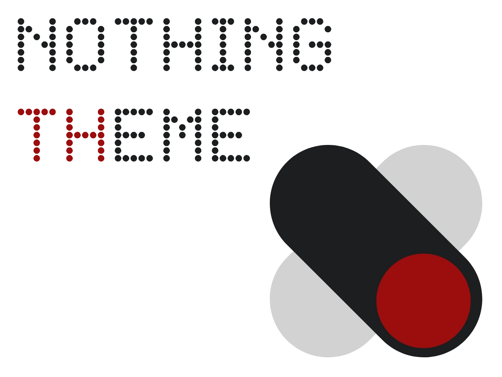

# Nothing Theme




---

## What It Is

Ultra-minimal WordPress theme. No bloat, no opinions, no unnecessary features.

Works with any page builder (Elementor, Divi, Gutenberg, Brizy, etc.) or classic WordPress editing.


## Features

One feature only: **nothing extra**.

Just the bare minimum files WordPress requires. No widget areas, no sidebars, no bloated "features" you'll never use.


## Installation

1. Upload `nothing-theme` folder to `/wp-content/themes/`
2. Activate via **Appearance → Themes**
3. Build your site your way


## File Structure

```
nothing-theme/
├── style.css
├── functions.php
├── index.php
├── header.php
├── footer.php
├── single.php
├── page.php
├── 404.php
├── screenshot.png
└── readme.txt
```


## Notes

- No widget areas
- No sidebars
- No block patterns
- No theme options
- Just code


## Credits

Built by one dev who was tired of 50-file "minimal" themes.